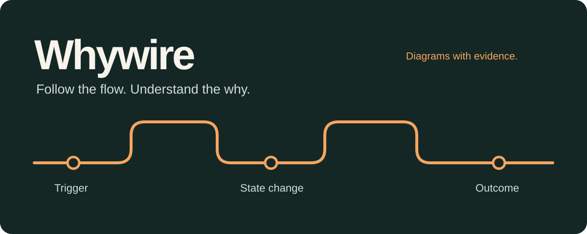
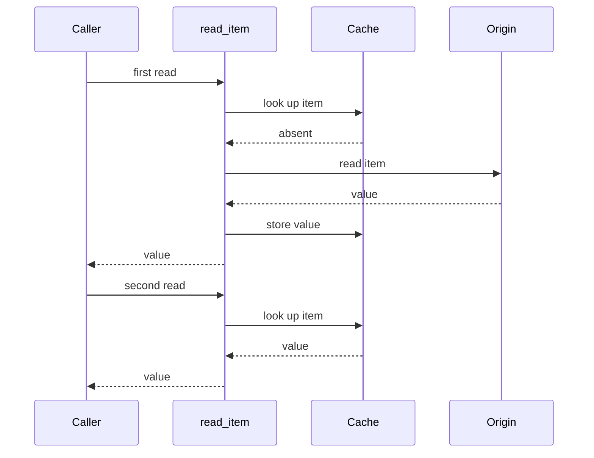

<p align="center">
  
</p>

<p align="center">
  <strong>Turn code behavior into diagrams you can check.</strong><br>
  An Agent Skill for architecture walkthroughs, causal explanations, and change reviews.
</p>

<p align="center">
  English · <a href="README.zh-CN.md">简体中文</a> · <a href="LICENSE">MIT</a>
</p>

Ask a question. Follow the path. Check the evidence.

```text
Use $whywire to explain what happens after a cache miss.
Use $whywire to show why a deleted item comes back.
Use $whywire to trace what this change does to the request flow.
```

Whywire helps an agent connect **trigger → boundary → state change → outcome**.
Important arrows point back to code. Observations, inferences, and proposed
changes stay distinguishable. The default output is Mermaid inside Markdown,
so you can read, edit, and keep it alongside your code.

## A small example

**Question:** Why do two calls return the value but read the origin only once?

**Answer:** `read_item` owns the cache-aside decision. The first call fills the
cache; the next call returns from the hit branch before reaching the origin.



Check the [implementation](examples/cache-read/app.py#L16-L25),
[runnable assertion](examples/cache-read/app.py#L37-L41), and
[full explanation](examples/cache-read/explanation.md), including what this
single-process example does **not** establish.

## When it helps

| Your question | Useful output |
| --- | --- |
| “What happens after I click Send?” | One execution path with concrete boundaries and state changes. |
| “Why is this cache or queue here?” | Its role in the inspected path and the assumptions behind that role. |
| “Why did the item reappear?” | A causal mechanism, source evidence, and a check that distinguishes alternatives. |
| “What does this PR change?” | Current and changed flows, with implemented behavior separated from proposals. |

The skill asks the agent to read the relevant source, inspect important
boundaries, draw the smallest useful view, and link the explanation to evidence.
It can also explain a design description, clearly labeled as a model of that
description. A short answer stays short when a diagram would add nothing.

## Install

Use an agent that supports Agent Skills and can read the source you want to
explain. The **skill has no runtime dependencies**; the agent supplies its usual
file-reading and optional rendering tools. The `npx` installer below needs
Node.js 22.20+ and npm; manual copying does not. Python is only used by
maintainer checks.

From a local checkout of this repository, install into the project where you
want to use it. Replace `/path/to/whywire` with the checkout's actual location:

```sh
cd /path/to/your-project
npx --yes skills@1.7.0 add /path/to/whywire --skill whywire --agent codex --copy
```

For Claude Code, replace `--agent codex` with `--agent claude-code`.
These are project-scoped installs; no global flag is needed. Restart or reload
your agent session if it does not discover the new skill immediately.

Alternatively, copy the **entire** `skills/whywire/` directory into your agent's
skill location. Keep its `references/`, `agents/`, and `LICENSE` together.
See the [validation record](docs/validation.md) for what has actually been
tested. Installation checks do not prove every host's native discovery or model
behavior.

## Try a complete case

| Case | What you can inspect |
| --- | --- |
| [Two reads, one origin access](examples/cache-read/explanation.md) | An ordinary architecture walkthrough, with a directly observable outcome. |
| [A late result writes past deletion](examples/late-result/explanation.md) | Deletion, stale work, and why the write boundary owns the check. |
| [The database record cannot prove delivery](examples/delivery-handoff/explanation.md) | A real SQLite reopen, a modeled broker, and an ambiguous acknowledgement. |

Each case contains a raw `request.md`, small `app.py`, and a worked
`explanation.md`. They are **synthetic teaching cases**, not production incident
reports or a model benchmark. To try the skill, give the agent the request and
source before showing it the worked explanation.

## What is in this repository?

```text
skills/whywire/             The complete installable skill
  SKILL.md                 When to use it and how to reason
  references/              Evidence rules and diagram guidance, read as needed
  agents/openai.yaml       Display and invocation metadata
  LICENSE                  License travels with copied installations
examples/                  Three runnable cases and worked explanations
scripts/                   Maintainer checks; not part of the skill runtime
docs/                      Cover source and validation record
.github/                   CI and contribution templates
```

Most files help people **understand, verify, install, or contribute**. Only
`skills/whywire/` is installed. There is no custom diagram renderer, hosted
service, or automatic repository indexer.

## Develop and contribute

```sh
npm ci
npm run check
npm run check:install
```

The first check runs the Python examples, validates local file references, and
renders the Mermaid blocks with the official CLI. The second checks isolated,
copied installations. See [CONTRIBUTING.md](CONTRIBUTING.md) for prerequisites
and how to contribute a useful case.

We welcome small examples where a plausible diagram misses an important
boundary. Explain the question, provide shareable source, and show the outcome.
Keep private code, logs, and credentials out of public reports.

## Inspiration and license

Whywire builds on a practical architecture-explanation method: follow one
behavior, find its state owner, and make causal claims checkable. Its packaging
was informed by [answer-me-with-html](https://github.com/QingYunA/answer-me-with-html),
[Archify](https://github.com/tt-a1i/archify),
[Karpathy Skills](https://github.com/multica-ai/andrej-karpathy-skills), and
[Ponytail](https://github.com/DietrichGebert/ponytail).
These are inspirations, not affiliations or endorsements.

[MIT licensed](LICENSE). Whywire is pronounced “why-wire”: a wire you can follow
to understand why something happens.
