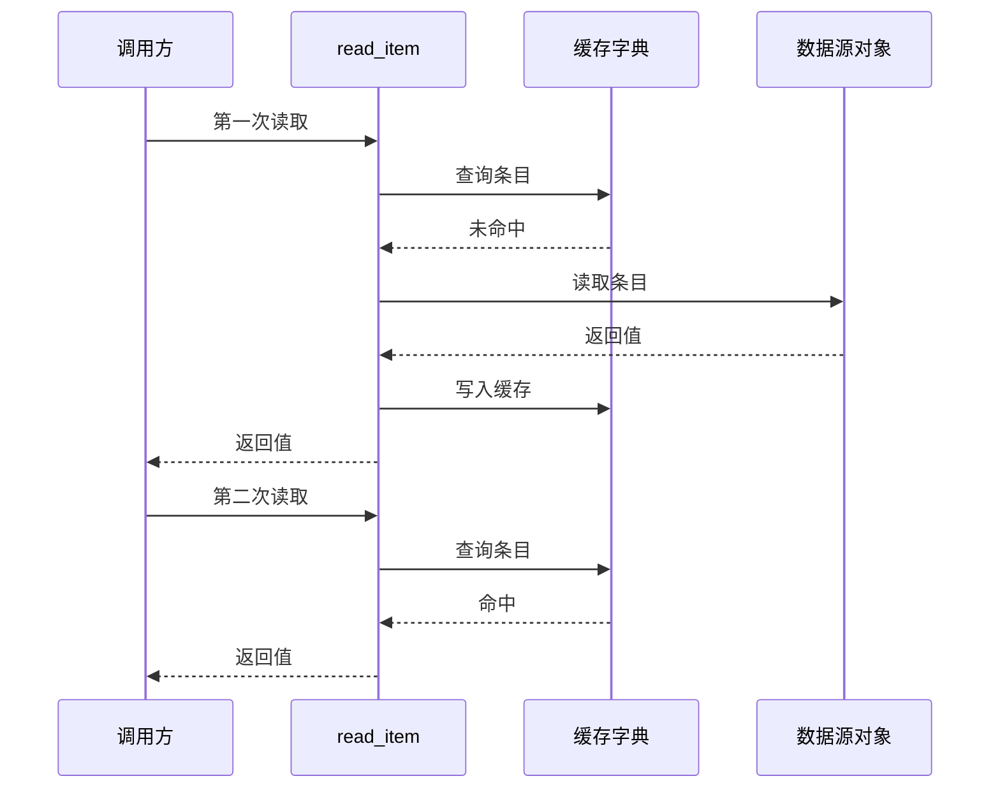

<p align="center">
  
</p>

<p align="center">
  <strong>从一个场景、一条请求，看懂系统架构。</strong><br>
  沿着请求梳理代码、模块职责与数据流转的 Agent Skill。
</p>

<p align="center">
  <a href="README.md">English</a> · 简体中文 · <a href="https://github.com/DolphinMiner/whywire">GitHub</a> · <a href="https://github.com/DolphinMiner/whywire/actions/workflows/check.yml">检查记录</a> · <a href="LICENSE">MIT</a>
</p>

**Whywire**，读作「why-wire」，中文昵称「因果线」。顺着流程，看懂缘由。

从读取条目、用户登录、发送消息这样的具体场景出发，Whywire 沿着
**用户操作 → 入口 → 模块调用 → 数据与状态变化 → 返回结果**，
解释这个场景里的架构：谁负责什么、模块之间传什么、结果如何回到调用方。

它首先用于理解项目、新人上手和梳理正常请求链路，也可以解释变更、分析故障。
重要的箭头有代码依据，观察结果与推断分别说清楚；默认产物是可以编辑的 Markdown + Mermaid。

## 用完会得到什么？

```text
用 $whywire 梳理读取 item-1 的场景，从调用入口一直跟到结果返回。
解释经过哪些模块、传递什么数据，以及再次读取时流程如何变化。
```

得到的是：**请求时序、模块职责、数据与返回路径，以及继续读代码的入口。**

**回答：** `read_item` 负责决定走缓存还是回源。第一次读取后填充缓存；
第二次命中时直接返回，不再执行回源调用。


这是使用进程内 Python 对象的可运行教学案例。实际产物是 Markdown + Mermaid，显示样式取决于宿主。

<details>
<summary>查看可编辑的 Mermaid 源码</summary>



</details>

查看对应的[实现](examples/cache-read/app.py#L16-L25)、
[可执行断言](examples/cache-read/app.py#L37-L41)和
[完整讲解](examples/cache-read/explanation.md)。完整讲解也说明了这个单进程案例的证明范围。

## 也能用于排障

理解正常链路之后，同样的方法也可以解释意外结果，例如：**「删掉的条目为什么又回来了？」**


查看[案例讲解](examples/late-result/explanation.md)和[对应源码](examples/late-result/app.py#L20-L27)。
排障是可选用途；日常架构梳理不需要先有故障，也不要求提出修复方案。

## 什么情况下有用？

| 你的问题 | 适合的产出 |
| --- | --- |
| 「点击发送之后发生了什么？」 | 一条具体执行链，标出边界和状态变化。 |
| 「刚接手这个项目，一次读取是怎么完成的？」 | 从场景梳理模块职责、数据流转和源码入口。 |
| 「这里为什么需要缓存或队列？」 | 解释它在已检查链路中的作用，以及依赖的假设。 |
| 「删掉的内容为什么又回来了？」 | 机制、源码依据，以及能够区分不同解释的验证方法。 |
| 「这个 PR 改变了什么？」 | 改动前后的流程，并区分已实现行为与提案。 |

Skill 引导 Agent 阅读相关源码、检查关键边界、选择足够小的图，并给出证据。
如果只有设计描述，也可以画图，但应明确这是对描述的建模。
一句话能解释清楚时，就用一句话。

## 安装

使用支持 Agent Skills、能够访问待解释源码的 Agent。
**Skill 本身没有运行时依赖**：文件读取和可选的渲染由宿主 Agent 提供。
下方的 `npx` 安装方式需要 Node.js 22.20+ 和 npm，手动复制不需要；
Python 仅用于维护者检查。

在你想理解源码的项目中执行：

```sh
cd /path/to/your-project
npx --yes skills@1.7.0 add DolphinMiner/whywire --skill whywire --agent codex --copy
```

Claude Code 用户把 `--agent codex` 换成 `--agent claude-code`。
这是项目级安装，不需要全局参数。如果当前会话没有发现新 Skill，可重新加载或启动会话。

如果使用本地副本，把命令中的 `DolphinMiner/whywire` 换成仓库的绝对路径，
例如 `/path/to/whywire`。手动安装时，把 **整个** `skills/whywire/` 复制到宿主的
Skill 目录，保留 `references/`、`agents/` 和 `LICENSE`。
已验证的范围见[验证记录](docs/validation.md)；安装检查不等于所有宿主的原生发现流程或模型效果都已验证。

## 三个完整案例

| 案例 | 能检查什么 |
| --- | --- |
| [读取两次，只回源一次](examples/cache-read/explanation.md) | 常规架构讲解，以及直接可观察的结果。 |
| [迟到结果越过删除](examples/late-result/explanation.md) | 删除、过期任务，以及为什么要在写入边界检查。 |
| [数据库记录不能证明送达](examples/delivery-handoff/explanation.md) | SQLite 实际重开、模拟的消息服务，以及不确定的确认结果。 |

每个案例包含原始问题 `request.md`、小程序 `app.py` 和讲解 `explanation.md`。
这些是**教学模拟**，不是生产事故报告，也不是模型效果榜单。
试用时，先只给 Agent 问题和源码，再对照讲解。

## 为什么一个 Skill 有这么多文件？

```text
skills/whywire/             完整可安装的 Skill
  SKILL.md                 何时使用，以及如何推理
  references/              按需阅读的证据规则和画图指南
  agents/openai.yaml       展示及调用元数据
  LICENSE                  随安装副本分发的许可证
examples/                  三个可运行案例及讲解
scripts/                   维护者检查，不属于 Skill 运行时
docs/                      封面、效果预览和验证记录
.github/                   CI 和贡献模板
```

大部分文件用于帮助别人**理解、验证、安装和参与贡献**。
真正安装的只有 `skills/whywire/`。项目不包含自建渲染器、托管服务或自动全库索引。

## 开发与贡献

```sh
npm ci
npm run check
npm run check:install
```

第一项检查运行 Python 案例、检查本地文件引用，并使用官方 CLI 渲染 Mermaid；
第二项在临时目录中检查复制安装。环境要求和贡献方法见
[CONTRIBUTING.md](CONTRIBUTING.md)。

最有价值的贡献是一个「图看起来合理，却遗漏了关键边界」的小案例：
说清问题，提供可以公开的源码，展示实际结果。请勿在公开反馈中放入私有代码、日志或凭证。

## 灵感与许可

Whywire 来自一套架构解释方法：跟一条行为链，找到状态的归属，让因果判断可以核查。
开源呈现方式参考了
[answer-me-with-html](https://github.com/QingYunA/answer-me-with-html)、
[Archify](https://github.com/tt-a1i/archify)、
[Karpathy Skills](https://github.com/multica-ai/andrej-karpathy-skills) 和
[Ponytail](https://github.com/DietrichGebert/ponytail)。这些是灵感来源，不代表合作或背书。

使用 [MIT 许可证](LICENSE)。
