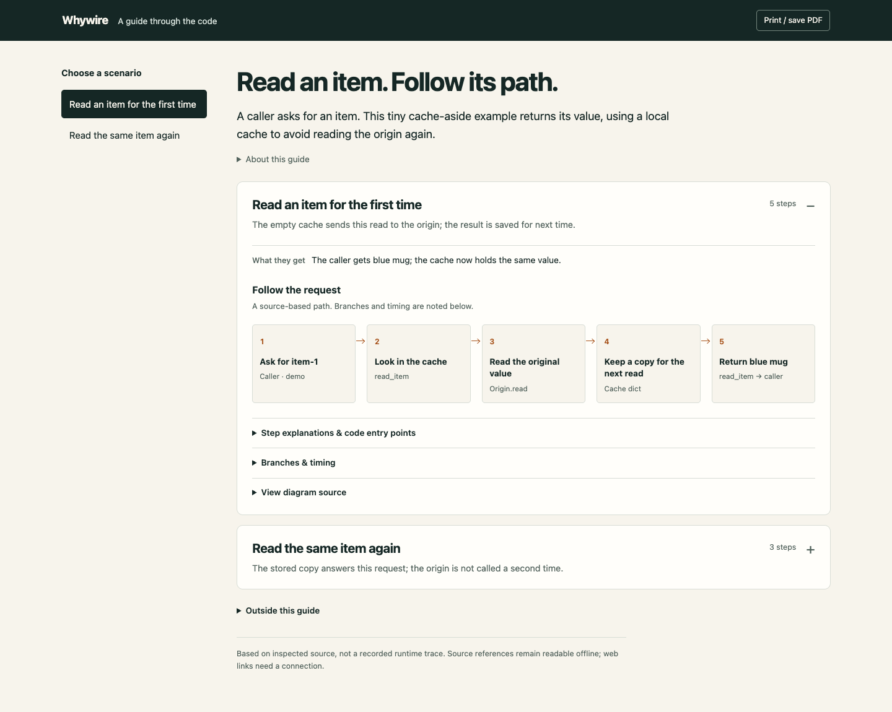

<p align="center">
  
</p>

<p align="center">
  <strong>理解产品场景，跟随真实请求，找到相关代码。</strong><br>
  基于项目源码，生成一份可直接打开的 HTML 架构导读的 Agent Skill。
</p>

<p align="center">
  <a href="README.md">English</a> · 简体中文 · <a href="https://github.com/DolphinMiner/whywire">GitHub</a> · <a href="https://github.com/DolphinMiner/whywire/actions/workflows/check.yml">检查记录</a> · <a href="LICENSE">MIT</a>
</p>

第一次接触项目？Whywire 先解释**产品能做什么、用户有哪些使用场景**，
再沿着每个纳入范围的场景，跟踪请求如何流转、结果如何返回。
你得到的是**一份 `whywire.html`**：流程图、简短解释，以及对应的代码入口。
用浏览器打开，读完就知道接下来该看哪段代码。

图和样式内嵌在文件中，可以离线阅读；源码链接仍需要访问其指向的仓库。
聊天里只给摘要、HTML 入口和覆盖范围，不再重复整篇长文。

## 用完会得到什么？



下载 [HTML 示例](examples/cache-read/guide.html)，用浏览器打开。
它讲解同一个条目被读取两次的场景：第一次填充缓存，第二次直接返回缓存值，不再回源。

这是使用进程内 Python 对象的**缓存读取教学模拟**，展示首次与再次读取的路径和交付形式，
不代表真实产品，也不是模型效果评测。可以核查[源码](examples/cache-read/app.py)、
[可执行断言](examples/cache-read/app.py#L37-L41)和
[导读输入](examples/cache-read/guide.json)。上图来自实际 HTML 页面截图，不是界面概念图。

## 从用户的动作开始提问

```text
用 $whywire 帮一个完全不了解这个项目的人上手。
先解释产品能做什么，再梳理主要使用场景，并跟踪每个纳入范围的场景的请求流转。
生成一份 whywire.html，包含流程图和代码入口，说明哪些部分尚未展开。
```

也可以只看一个场景：

```text
用 $whywire 解释用户点击发送后发生了什么。
一直跟到用户看见回复，标出每一步应该去哪里读代码。
```

导读按这个顺序展开：

| 阅读顺序 | 回答的问题 |
| --- | --- |
| 理解产品 | 给谁用、用户做什么、最终得到什么？ |
| 选择场景 | 根据已检查的产品与代码，主要使用场景有哪些？ |
| 跟随请求 | 从哪里触发、谁来处理、数据如何变化、结果怎样回来？ |
| 继续读代码 | 每一步对应哪些文件和函数？ |

每个场景只展示一张紧凑的流程图和简短解释。证据、图形源码和深入细节保留在折叠内容中。
影响理解的分支仍然展示；尚未梳理的场景明确标注，不把局部分析说成覆盖了整个项目。

小问题可以直接在聊天中回答，用户指定的格式优先。
也支持排障和改动对比，但架构梳理不需要先有 bug。
从源码推导出的路径，与实际运行验证过的路径分别标明。

## 安装

使用支持 Agent Skills、能够访问待解释源码的 Agent。
内置 HTML 生成器需要 **Node.js 18+**，没有 npm 依赖。
下方的 `npx` 安装方式需要 **Node.js 22.20+ 和 npm**；手动复制 Skill 不需要 npm。
Python 仅用于仓库维护者检查。

在你想理解源码的项目中执行：

```sh
cd /path/to/your-project
npx --yes skills@1.7.0 add DolphinMiner/whywire --skill whywire --agent codex --copy
```

Claude Code 用户把 `--agent codex` 换成 `--agent claude-code`。
这是项目级安装。如果当前会话没有发现新 Skill，可重新加载或启动会话。

如果使用本地副本，把 `DolphinMiner/whywire` 换成仓库绝对路径，例如 `/path/to/whywire`。
手动安装时，把**整个** `skills/whywire/` 复制到宿主的 Skill 目录，保留
`assets/`、`scripts/`、`references/`、`agents/` 和 `LICENSE`。
实际检查范围见[验证记录](docs/validation.md)；安装检查不等于所有宿主的原生发现流程或模型效果都已验证。

## 案例与源码依据

| 案例 | 能检查什么 |
| --- | --- |
| [读取两次，只回源一次](examples/cache-read/guide.html) | HTML 导读及其对应的可运行缓存案例。 |
| [迟到结果越过删除](examples/late-result/explanation.md) | 删除、过期任务和写入边界的分析。 |
| [数据库记录不能证明送达](examples/delivery-handoff/explanation.md) | SQLite 实际重开、模拟消息服务和不确定确认结果的分析。 |

三个案例都是教学模拟。各自的 `request.md`、`app.py` 和 `explanation.md`
保留了原始问题、可运行源码和分析过程。旧版 Markdown 讲解作为参考材料，
HTML 导读是当前主要的文件交付形式。评估方法时，先只给 Agent 问题和源码，再对照已有答案。

## 为什么一个 Skill 有这么多文件？

```text
skills/whywire/             完整可安装的 Skill
  SKILL.md                 工作流程与交付约定
  scripts/build-guide.mjs  独立 HTML 生成器，仅使用 Node 标准库
  assets/guide.html        内嵌页面模板
  references/              证据规则、画图与导读编写指南
  agents/openai.yaml       展示及调用元数据
  LICENSE                  随安装副本分发的许可证
examples/                  可公开案例、源码与 HTML 示例
scripts/                   维护者检查与预览生成
docs/                      封面、截图和验证记录
.github/                   CI 和贡献模板
```

真正安装的只有 `skills/whywire/`。Agent 负责阅读和解释源码，
小型生成器把解释打包成可离线阅读的页面。不需要托管服务，也没有自动全库索引。

## 开发与贡献

```sh
npm ci
npm run check
npm run check:guide
npm run check:install
npm run demo:guide
```

检查覆盖可运行案例、本地引用、Mermaid 渲染、HTML 生成和复制安装。
`demo:guide` 重建公开 HTML 示例。环境要求和截图生成方式见
[CONTRIBUTING.md](CONTRIBUTING.md)。这些检查验证产物与工具，不等于验证模型效果。

有价值的贡献是一个导读没讲清楚的真实问题：提供能够公开的最小源码，展示实际结果。
请勿在公开反馈中放入私有代码、日志或凭证。

## 灵感与许可

开源呈现方式参考了
[answer-me-with-html](https://github.com/QingYunA/answer-me-with-html)、
[Archify](https://github.com/tt-a1i/archify)、
[Karpathy Skills](https://github.com/multica-ai/andrej-karpathy-skills) 和
[Ponytail](https://github.com/DietrichGebert/ponytail)。这些是灵感来源，不代表合作或背书。

使用 [MIT 许可证](LICENSE)。Whywire 读作「why-wire」：顺着一条线，看懂系统为何这样运行。
