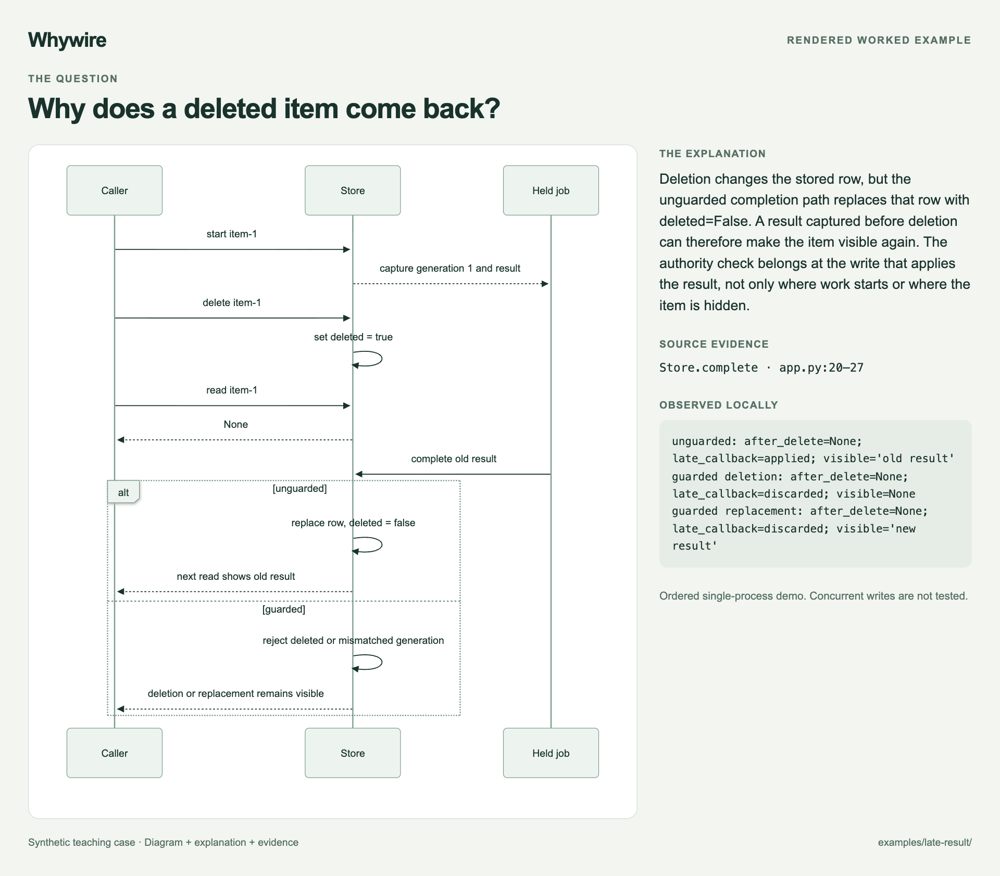
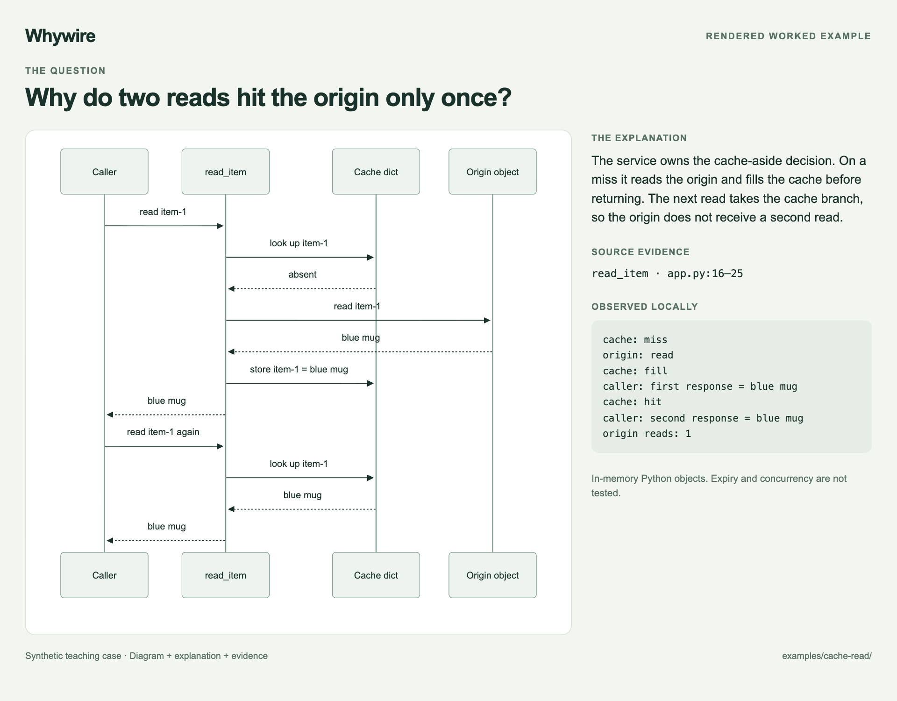
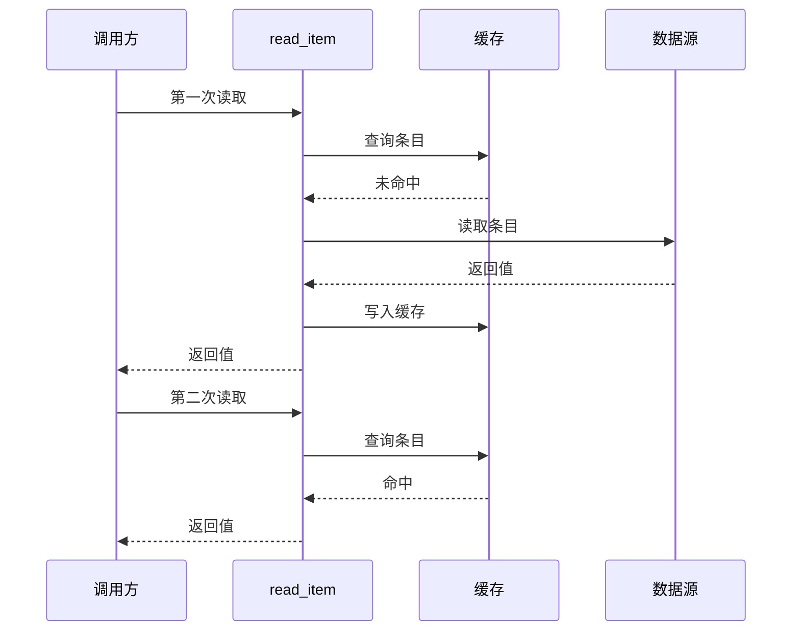

<p align="center">
  
</p>

<p align="center">
  <strong>把代码行为画成有依据的因果图。</strong><br>
  用于架构讲解、问题分析和变更解释的 Agent Skill。
</p>

<p align="center">
  <a href="README.md">English</a> · 简体中文 · <a href="LICENSE">MIT</a>
</p>

**Whywire**，读作「why-wire」，中文昵称「因果线」。顺着流程，看懂缘由。

Whywire 帮助 Agent 串起 **触发 → 跨越边界 → 状态变化 → 可见结果**。
重要的箭头有代码依据，观察结果、推断和改进提案分别说清楚。
默认输出 Markdown 中的 Mermaid，可以直接阅读、修改，并和代码一起维护。

## 用完会得到什么？

```text
用 $whywire 解释这段代码里，为什么删掉的条目又出现了。
```

得到一份可以核查的解释：**因果图、导致问题的写入位置、源码依据和可观察的结果。**



这是可运行教学案例的讲解预览。实际产物是 Markdown + Mermaid，显示样式取决于宿主。
查看[完整解释](examples/late-result/explanation.md)和[对应源码](examples/late-result/app.py#L20-L27)。

## 看一个小例子

**问题：** 为什么读取两次都拿到了值，却只回源一次？

**回答：** `read_item` 负责决定走缓存还是回源。第一次读取后填充缓存；
第二次命中时直接返回，不再执行回源调用。



<details>
<summary>查看可编辑的 Mermaid 源码</summary>



</details>

查看对应的[实现](examples/cache-read/app.py#L16-L25)、
[可执行断言](examples/cache-read/app.py#L37-L41)和
[完整讲解](examples/cache-read/explanation.md)。完整讲解也说明了这个单进程案例的证明范围。

## 什么情况下有用？

| 你的问题 | 适合的产出 |
| --- | --- |
| 「点击发送之后发生了什么？」 | 一条具体执行链，标出边界和状态变化。 |
| 「这里为什么需要缓存或队列？」 | 解释它在已检查链路中的作用，以及依赖的假设。 |
| 「删掉的内容为什么又回来了？」 | 机制、源码依据，以及能够区分不同解释的验证方法。 |
| 「这个 PR 改变了什么？」 | 改动前后的流程，并区分已实现行为与提案。 |

Skill 引导 Agent 阅读相关源码、检查关键边界、选择足够小的图，并给出证据。
如果只有设计描述，也可以画图，但应明确这是对描述的建模。
一句话能解释清楚时，就用一句话。

## 安装

使用支持 Agent Skills、能够访问待解释源码的 Agent。
**Skill 本身没有运行时依赖**：文件读取和可选的渲染由宿主 Agent 提供。
下方的 `npx` 安装方式需要 Node.js 22.20+ 和 npm，手动复制不需要；
Python 仅用于维护者检查。

准备好这个仓库的本地副本，在你想使用它的项目中执行。
把 `/path/to/whywire` 换成仓库的实际位置：

```sh
cd /path/to/your-project
npx --yes skills@1.7.0 add /path/to/whywire --skill whywire --agent codex --copy
```

Claude Code 用户把 `--agent codex` 换成 `--agent claude-code`。
这是项目级安装，不需要全局参数。如果当前会话没有发现新 Skill，可重新加载或启动会话。

也可以把 **整个** `skills/whywire/` 复制到宿主的 Skill 目录，保留
`references/`、`agents/` 和 `LICENSE`。
已验证的范围见[验证记录](docs/validation.md)；安装检查不等于所有宿主的原生发现流程或模型效果都已验证。

## 三个完整案例

| 案例 | 能检查什么 |
| --- | --- |
| [读取两次，只回源一次](examples/cache-read/explanation.md) | 常规架构讲解，以及直接可观察的结果。 |
| [迟到结果越过删除](examples/late-result/explanation.md) | 删除、过期任务，以及为什么要在写入边界检查。 |
| [数据库记录不能证明送达](examples/delivery-handoff/explanation.md) | SQLite 实际重开、模拟的消息服务，以及不确定的确认结果。 |

每个案例包含原始问题 `request.md`、小程序 `app.py` 和讲解 `explanation.md`。
这些是**教学模拟**，不是生产事故报告，也不是模型效果榜单。
试用时，先只给 Agent 问题和源码，再对照讲解。

## 为什么一个 Skill 有这么多文件？

```text
skills/whywire/             完整可安装的 Skill
  SKILL.md                 何时使用，以及如何推理
  references/              按需阅读的证据规则和画图指南
  agents/openai.yaml       展示及调用元数据
  LICENSE                  随安装副本分发的许可证
examples/                  三个可运行案例及讲解
scripts/                   维护者检查，不属于 Skill 运行时
docs/                      封面、效果预览和验证记录
.github/                   CI 和贡献模板
```

大部分文件用于帮助别人**理解、验证、安装和参与贡献**。
真正安装的只有 `skills/whywire/`。项目不包含自建渲染器、托管服务或自动全库索引。

## 开发与贡献

```sh
npm ci
npm run check
npm run check:install
```

第一项检查运行 Python 案例、检查本地文件引用，并使用官方 CLI 渲染 Mermaid；
第二项在临时目录中检查复制安装。环境要求和贡献方法见
[CONTRIBUTING.md](CONTRIBUTING.md)。

最有价值的贡献是一个「图看起来合理，却遗漏了关键边界」的小案例：
说清问题，提供可以公开的源码，展示实际结果。请勿在公开反馈中放入私有代码、日志或凭证。

## 灵感与许可

Whywire 来自一套架构解释方法：跟一条行为链，找到状态的归属，让因果判断可以核查。
开源呈现方式参考了
[answer-me-with-html](https://github.com/QingYunA/answer-me-with-html)、
[Archify](https://github.com/tt-a1i/archify)、
[Karpathy Skills](https://github.com/multica-ai/andrej-karpathy-skills) 和
[Ponytail](https://github.com/DietrichGebert/ponytail)。这些是灵感来源，不代表合作或背书。

使用 [MIT 许可证](LICENSE)。
