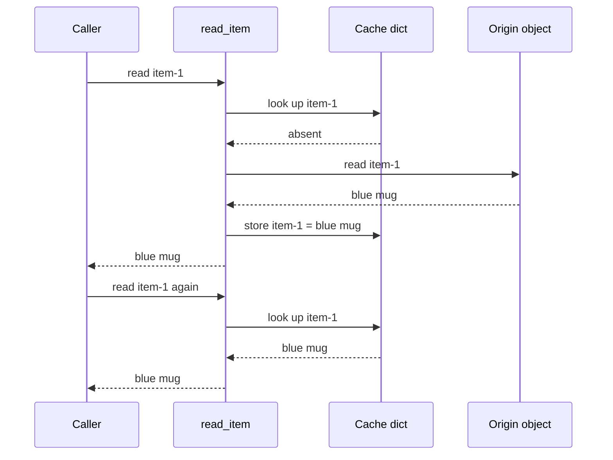

# Two reads, one origin access

The service owns the cache-aside decision. On a miss it reads the origin and
fills the cache before returning. The next read takes the cache branch, so the
origin does not receive a second read.

This is a synthetic, single-process teaching case. The cache and origin are
Python objects, not Redis and a remote database.



## Evidence

| Claim | Source or observation |
| --- | --- |
| The hit branch returns before the origin call. | [`read_item`, lines 16–25](app.py#L16-L25). |
| The origin call increments an observable read count. | [`Origin.read`, lines 11–13](app.py#L11-L13). |
| Both calls share one cache and one origin. | [`demo`, lines 28–34](app.py#L28-L34). |
| Both responses are `blue mug`; origin reads are `1`. | `python3 app.py` and [`check`, lines 37–41](app.py#L37-L41). |

The demonstrated invariant is narrow: **for two sequential reads of this
unchanged item, the cache returns the same value and avoids a second origin
read**. The origin holds the underlying value; the cache is a derived copy.

## Unknowns and limits

There is no expiry or invalidation. Updating `Origin.values` would not refresh
an existing cache entry. Concurrent misses, origin failure, missing items,
process restart, and distributed consistency are outside this demonstration.
The output establishes neither production cache freshness nor latency savings.

## Verify

From this directory:

```sh
python3 app.py
python3 app.py --check
```

The check observes caller return values and origin read count, not diagram
text. Expected check output:

```text
PASS: both callers received the value; the origin was read once.
```

No additional architecture is justified by this happy-path example. If
freshness becomes a requirement, first specify what may change and how stale
a response may be, then test that requirement at `read_item`.
