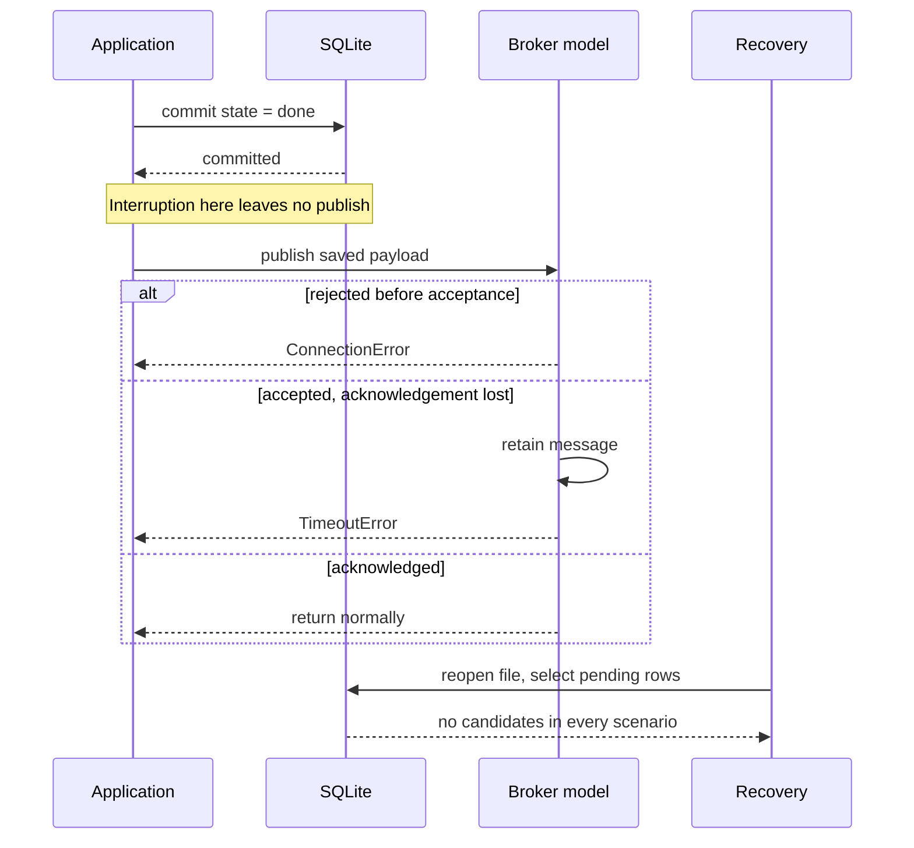

# The database record cannot prove delivery

`deliver` commits `done` before publishing. Recovery selects only `pending`
rows, so an interruption in that interval leaves a durable terminal row that
recovery ignores. A lost acknowledgement adds a different problem: the broker
may have accepted the message even though the caller saw an error. The same
database row therefore covers both missing and accepted delivery.

This is a synthetic teaching case. SQLite commits and file reopening are real.
The broker is an in-memory model; interruption is an exception at a fixed
boundary, not a killed process or a real network failure.



The diagram's publish branches apply only if execution reaches `publish`.
The `interrupted` scenario stops at the marked commit-to-publish boundary.

## Evidence

| Claim | Source or observation |
| --- | --- |
| The reviewed payload is persisted before dispatch. | [`demo`, lines 42–45](app.py#L42-L45). |
| The terminal commit precedes publishing. | [`deliver`, lines 23–31](app.py#L23-L31). |
| Rejection happens before acceptance; lost acknowledgement happens after it. | [`Broker.publish`, lines 15–20](app.py#L15-L20). |
| Recovery considers only `pending`. | [`recover`, lines 34–35](app.py#L34-L35). |
| The result is inspected through a newly opened SQLite connection. | [`demo`, lines 51–58](app.py#L51-L58). |
| Broker acceptance is privileged demo instrumentation, unavailable to recovery. | [`Broker`, line 13](app.py#L13); [`demo`, lines 59–61](app.py#L59-L61). |

The broken invariant is: **work must not become unrecoverable before its
required delivery outcome is established**. Persisting the payload is useful,
but the terminal status still prevents the recovery path from selecting it.

## What is known, and by whom?

After reopening, every scenario has `("done", "reviewed payload")` and no
recovery candidates. The demonstration observer additionally sees:

| Scenario | Caller observation | Broker acceptances visible to demo observer |
| --- | --- | --- |
| `acknowledged` | no error | 1 |
| `interrupted` | simulated interruption | 0 |
| `rejected` | explicit rejection | 0 |
| `lost_ack` | timeout | 1 |

These broker counts are known because the controlled model exposes its list
to the demo. The recovery code has no lookup API. The timeout alone does not
tell an application that acceptance occurred. A real provider's guarantees
cannot be inferred from this list.

## Verify

From this directory:

```sh
python3 app.py
python3 app.py --check
```

[`check`, lines 64–75](app.py#L64-L75) compares the persisted row and recovery
selection with observed acceptance across the four modes. Expected output:

```text
PASS: reopened SQLite has the same terminal row for zero or one broker acceptance; recovery selects none.
```

## Smallest justified next step

Keep a dispatch attempt recoverable until its outcome is established, and
retain the reviewed payload already saved here. Before choosing a retry rule,
check whether the actual broker supports a stable idempotency key, lookup by
attempt, or another authoritative reconciliation method. Explicit rejection
and an ambiguous timeout require different treatment.

Moving `done` after publishing would address the shown pre-publish terminal
window but still leaves a crash after acceptance and before recording success.
Blindly retrying that unknown outcome can duplicate delivery. This example
does not implement a fix and does not establish that an outbox, new worker, or
exactly-once mechanism is necessary or sufficient. A proposed fix should be
checked at both commit/publish boundaries and the lost-acknowledgement case.
