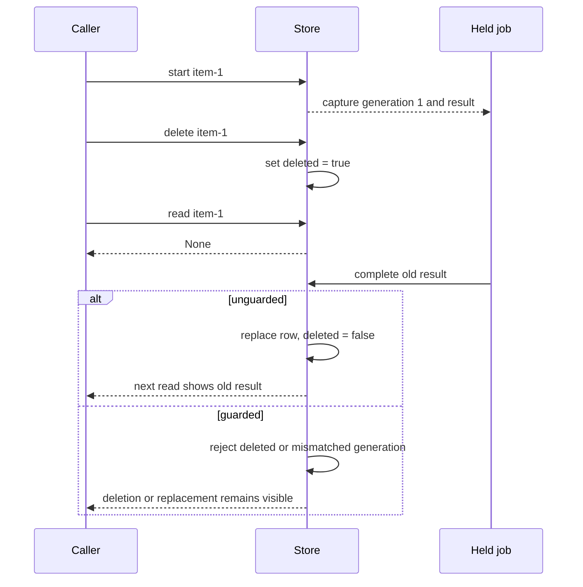

# A late result writes past deletion

Deletion changes the stored row, but the unguarded completion path replaces
that row with `deleted=False`. A result captured before deletion can therefore
make the item visible again. The authority check belongs at the write that
applies the result, not only where work starts or where the item is hidden.

This is a synthetic teaching case. `demo` explicitly schedules operations in
one process; there is no background thread or real queue. The held job in the
diagram is a Python dictionary, not an additional service.



## Evidence

| Claim | Source or observation |
| --- | --- |
| Starting work assigns a new generation and captures it in the job. | [`Store.start`, lines 11–15](app.py#L11-L15). |
| Deletion preserves a tombstone in the row. | [`Store.delete`, lines 17–18](app.py#L17-L18). |
| Unguarded completion writes a fresh row with `deleted=False`. | [`Store.complete`, lines 20–27](app.py#L20-L27). |
| The guarded variant checks both deletion and generation. | [`Store.complete`, lines 21–24](app.py#L21-L24). |
| The observable result comes from `Store.read`, not the callback status alone. | [`Store.read`, lines 29–31](app.py#L29-L31); [`demo`, lines 34–43](app.py#L34-L43). |

The invariant is: **a job may update only the still-live generation for which
it was started**. A tombstone protects deletion; a generation check also
protects a replacement created under the same key. Checking only `deleted`
would allow an old job to overwrite a new, live row.

## Verify

From this directory:

```sh
python3 app.py
python3 app.py --check
```

The default run produces these observations:

```text
unguarded: after_delete=None; late_callback=applied; visible='old result'
guarded deletion: after_delete=None; late_callback=discarded; visible=None
guarded replacement: after_delete=None; late_callback=discarded; visible='new result'
```

[`check`, lines 46–54](app.py#L46-L54) checks the public read result after
deletion and replacement. It also checks that a current, live job still
completes, so rejecting all work would not satisfy the check.

## Unknowns and limits

The guarded demonstration covers the stated operation order. Its check and
write are separate Python statements. It does **not** establish atomicity
against a concurrent deletion between them, durable generations after restart,
or correct tombstone retention. No general concurrency claim follows.

For a real concurrent store, the next verification is a race at the actual
storage boundary: make deletion or replacement occur during completion, and
confirm an atomic conditional write cannot change the wrong generation. Use
the existing storage mechanism if it supports that invariant; this example
does not justify a new service or queue.
