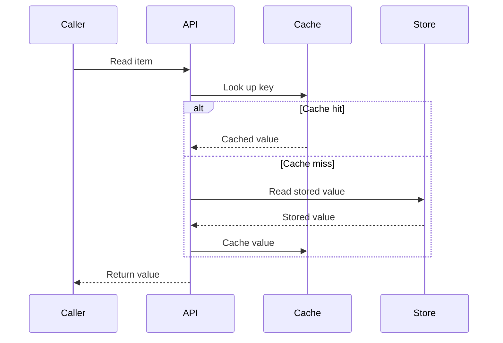
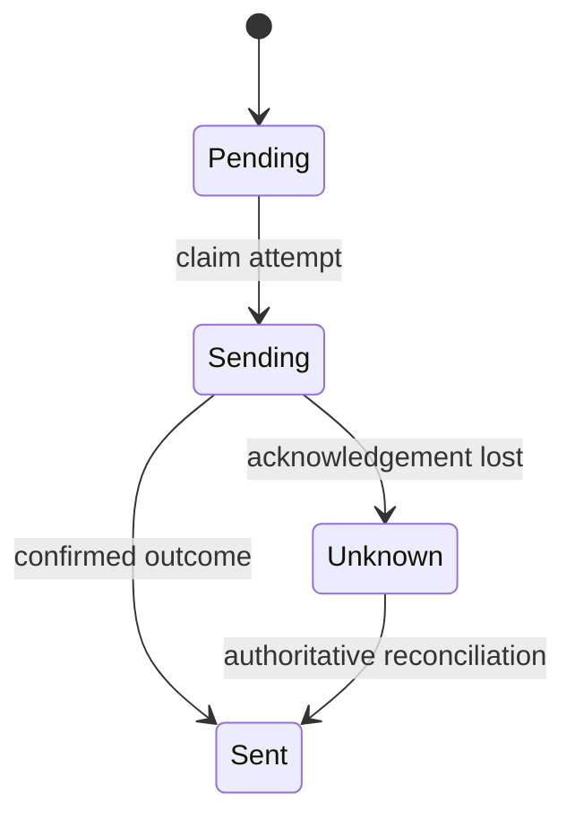
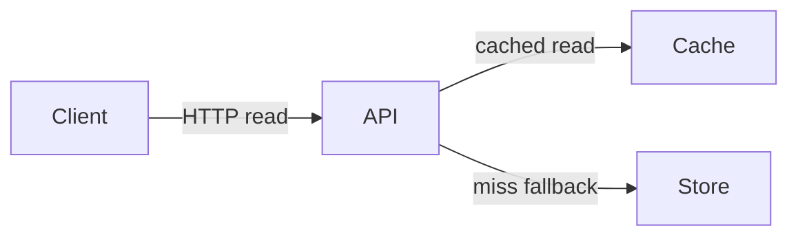

# Choose the view that explains the question

These diagrams are illustrative syntax examples, not claims about a repository.
Replace their participants, ordering, and states with the inspected behavior.

## A request crossing boundaries

Use `alt` for mutually exclusive paths, `opt` for an optional step, and `par`
only when concurrency is supported. An arrow is an operation or message, not
proof of a durable transaction or delivery guarantee. Add a note for a gap.

## A lifecycle with an unresolved result

Do not draw an automatic retry from `Unknown` unless the implementation
establishes how duplication is prevented. Include exits or recovery only when
the available evidence supports them; otherwise label them unresolved.

## A structural view

Use a structural view when the question concerns responsibilities or dependencies.
Switch to a sequence or lifecycle view when ordering changes the answer.

## Keep the source portable

- Use simple ASCII identifiers and human-readable labels.
- Quote flowchart labels containing punctuation or code-like text.
- Keep sequence message and note text on one line. Avoid literal semicolons
  in that text: Mermaid can interpret them as statement separators. Write
  `save payload and commit`, for example, instead of joining those operations
  with a semicolon. Prefer short words over parser-sensitive punctuation.
- Keep source links and longer evidence notes in a table outside the diagram.
- Prefer standard diagram syntax over renderer-specific themes, HTML labels,
  click handlers, icons, or custom JavaScript.
- If an available renderer rejects the diagram, simplify and retry. A rendered
  diagram establishes syntactic renderability, not factual correctness.
